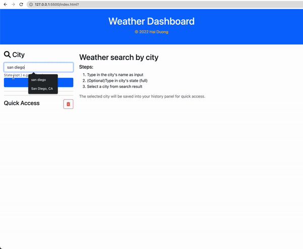

# weather-forecast
### Author: Hai Duong
### [Demo link](https://caubenondo.github.io/weather-forecast/)

#### Description
The App allows user to retrieve weather conditon of cities by searching city name (and state). 

It is powered by Use the [OpenWeather One Call API](https://openweathermap.org/api/one-call-api) to retrieve weather conditions, [Moment.js](https://momentjs.com) to format time, and local storage.

#### How to use
- Type in the city's name as input
- (Optional)Type in city's state (full)
- Select a city from search result
`The selected city will be saved into your quick access panel for future use.`

#### Frameworks and API
- Bootstrap 5
- Font-Awesome
- Moment JS
- Open Weather API
- ~~Chart.js~~ (removed because the graph cluster the clean look of the app)
#### App in Action
